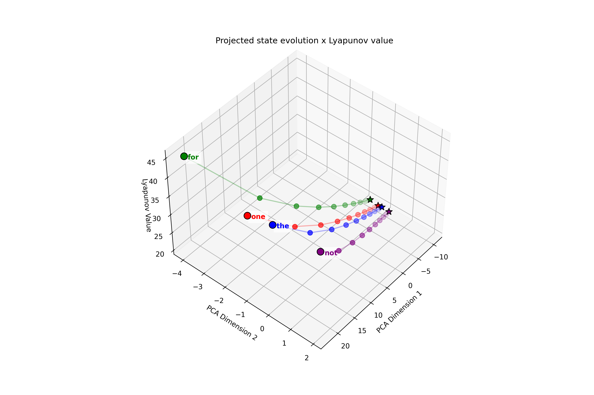

# Training the generalized Lotka-Volterra Interactive Activation Model

  

## Overview
This repository contains the implementation to train the **gLIA** model, a hybrid of the **Interactive Activation (IA)** and **Generalized Lotka-Volterra (gLV)** models. Both are first-order, autonomous, quadratic ordinary differential equations (ODEs), but IA's peculiarities make it analytically challenging. This study explores whether a gLV-endowed IA model can be trained effectively and compares its performance to an IA baseline on a simple word recognition task, evaluating classification accuracy and robustness. Training relies on the excellent [TorchDiffEq PyTorch library](https://github.com/rtqichen/torchdiffeq).

*All models and analyses can be found in the notebook* [gLIA_ODE.ipynb](https://colab.research.google.com/github/THANNAGA/generalized_Lotka_Volterra_Interactive_Activation/blob/main/gLIA_ODE.ipynb)

## Purpose
The goal is to:
- Train a gLIA model using gLV dynamics with IA's sign-symmetry constraint.
- Assess its performance against the IA baseline in terms of accuracy and stability.
- Investigate the scalability and mathematical tractability of gLIA for cognitive modeling.

## Models

### Interactive Activation (IA)
Introduced by McClelland and Rumelhart (1981), IA organizes units into levels with reciprocal interactions via a connectivity matrix $M$. A key feature is **sign-symmetry**: 

(sign(Mij) = sign(Mji)), enabling cooperation or competition. The dynamics are:

$$
x_i^{t+1} = \begin{cases}
(1 - d_i) x_i^t + \text{net}_i^t (1 - x_i^t) & \text{if } \text{net}_i^t > 0 \\
(1 - d_i) x_i^t + \text{net}_i^t x_i^t & \text{if } \text{net}_i^t \le 0
\end{cases}
$$

where (netit = &sum;j ≠ i Mij ReLU(xjt)), and di > 0 is a decay term. 

**Limitations**: IA's dual equations and ReLU non-linearity make it non-differentiable and analytically intractable, complicating stability analysis and weight optimization.

### Generalized Lotka-Volterra (gLV)
Rooted in theoretical ecology (Lotka, 1920; Volterra, 1926), gLV models population dynamics with cooperation and competition:

$$
\frac{dx}{dt} = D(x)(r + Mx)
$$

where $D(x)$ is a diagonal matrix of $x$, $r$ is the growth rate vector, and $M$ is the interaction matrix. A feasible equilibrium, when $M$ is invertible, is $x^* = -M^{-1}r$. gLV supports complex dynamics (e.g., limit cycles, chaos) but is differentiable.

### gLIA: Combining IA and gLV
gLIA uses gLV dynamics with IA's sign-symmetry constraint: $\text{sign}(m_{ij}) = \text{sign}(m_{ji})$. It aims to retain IA's cognitive relevance while leveraging gLV's trainability and stability properties.

## Methods

### Task
We model a two-level lexical system (letters and words) for word recognition, using the "Google 10,000 English" dataset (words ≥ 3 letters). A word is recognized if its unit is the most active after 50 time steps given its constituent letters.

### Training
Using the **adjoint method** (Chen et al., 2018), we train gLIA as a dynamical classifier:
- **Input**: Letter-position vectors with Gaussian noise (100 samples/word).
- **Target**: One-hot word vectors.
- **Loss**: Mean Squared Error (MSE).
- **Optimizer**: Adam with stability regularization (sum of positive eigenvalue real parts).
- **Library**: `torchdiffeq` for ODE gradient computation.

Four models are compared:
1. **gLIA**: Unconstrained interaction matrix.
2. **gLIA Symmetric**: Enforces $M = M^T$.
3. **gLIA Negative Definite**: Ensures $M$ has negative eigenvalues.
4. **IA**: Baseline with original dynamics.

### Stability
gLIA stability depends on $M$ and $r$. We regularize $M$ to keep eigenvalues as negative as possible, aiming at bounded dynamics even in absence of IA's dual equations.

## Results
Test accuracies (Table 1) show gLIA outperforms IA:

| Words | Samples | Units | Parameters | Params (Sym) | Test Acc. (%) gLIA | gLIA Sym. | gLIA Neg. Def. | IA   |
|-------|---------|-------|------------|--------------|---------------------|-----------|----------------|------|
| 10    | 1,000   | 114   | 12,996     | 6,555        | 100.00              | 100.00    | 100.00         | 100.00 |
| 20    | 2,000   | 144   | 20,736     | 10,440       | 100.00              | 100.00    | 98.87          | 100.00 |
| 30    | 3,000   | 160   | 25,600     | 12,880       | 100.00              | 100.00    | 96.67          | 96.33  |
| 100   | 10,000  | 181   | 32,761     | 16,471       | 100.00              | 100.00    | 100.00         | 98.67  |
| 200   | 20,000  | 310   | 96,100     | 48,205       | 86.17               | 94.10     | 90.28          | 74.67  |
| 500   | 500,000 | 708   | 501,264    | 251,586      | 36.94               | 89.88     | 89.74          | 5.66   |
| 1000  | 1M      | 1157  | 1,338,149  | 669,903      | 20.41               | 91.69     | 90.34          | 0.30   |

- **Key Findings**:
  - gLIA scales to 1,000 words, with symmetric and negative definite variants outperforming others.
  - IA degrades significantly beyond 200 words.
  - Symmetric gLIA with negative definite $M$ is globally stable, admitting a Lyapunov function:

$$
L(x) = -r^T x - \frac{1}{2} x^T M x - \frac{1}{2} r^T M^{-1} r
$$

*All models and analyses can be found in the notebook* [gLIA_ODE.ipynb](https://colab.research.google.com/github/THANNAGA/generalized_Lotka_Volterra_Interactive_Activation/blob/main/gLIA_ODE.ipynb)
